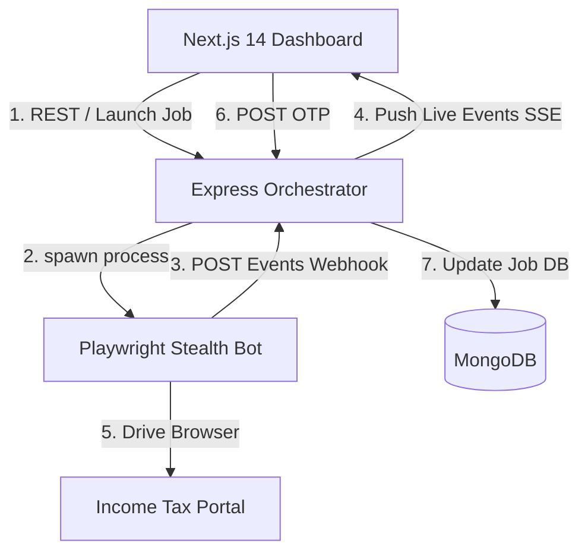

# Architecture Documentation

This document explains the technical architecture, design patterns, and engineering choices of the ITR Credentials Generation Automation system.

---

## 1. Core Architecture Diagram

---

## 2. Pillar 1: Playwright State Machine

The automation bot (`automation/src/index.js`) is designed as a **finite state machine (FSM)**. Rather than relying on rigid linear execution, the bot repeatedly evaluates the current state of the page (URL, visible elements) to decide which action to perform next.

### Evaluated States (`STATES`)
* `LOGIN_PAGE`: PAN entry screen.
* `LOGIN_PASSWORD_PAGE`: Password screen (redirects to forgot password if PAN is already registered).
* `REGISTER_GET_STARTED`: Main registration landing page.
* `REG_BASIC_DETAILS`: Name, Date of Birth, and residential status entry.
* `REG_CONTACT_DETAILS`: Contact email, mobile, and address fields.
* `REG_OTP` / `FORGOT_PASSWORD_OTP_CHOICE`: Human-in-the-loop validation screens.
* `SET_PASSWORD`: Password configuration screen.
* `SUCCESS` / `DASHBOARD`: Terminal successful states.

### Human-in-the-Loop OTP Flow
1. The bot navigates to the OTP page and detects the input fields.
2. It sends a webhook to the backend declaring status `REG_OTP` and pauses.
3. The server updates the Job database state and streams `REG_OTP` to the Next.js UI via SSE.
4. The dashboard displays an input field to the operator.
5. Once the operator inputs the OTP, the UI sends a `POST` request to the backend.
6. The bot, which is polling the database or checking the state at regular intervals, detects the supplied OTP, enters it, and continues execution.

---

## 3. Pillar 2: Live Events Pipeline (SSE + Webhooks)

To ensure zero latency and a production-grade message delivery mechanism, we avoid polling loops and use Server-Sent Events (SSE).

### Webhook Ingest
* The bot executes POST requests to `/webhook/events` for every state change.
* Webhook requests are signed and authenticated via a pre-shared `Bearer WEBHOOK_SECRET` token.

### SSE Stream & Replay
* **Live Stream**: The Express server uses a native Node.js `EventEmitter` to fan out incoming webhook events instantly to all active SSE browser connections listening on `job-${jobId}`.
* **Resiliency & Backlog Recovery**: If a client's network drops mid-stream, the browser reconnects and sends the last received sequence number using the `Last-Event-ID` HTTP header. The backend automatically queries MongoDB for any events with `seq > Last-Event-ID` and flushes them before connecting the client to the live stream.
* **Memory Safety**: Event listeners are cleaned up (`liveStream.removeListener`) as soon as the client disconnects (`req.on('close')`), preventing memory leaks.

---

## 4. Data Modeling & Database Trade-offs

### Collections & Indexing
1. **`jobs`**: Persists run metadata (job ID, masked PAN, state status, creator, start/end timestamps, registration payload).
2. **`events`**: Stores the raw stream logs.
   * **Compound Index**: `{ jobId: 1, seq: 1 }` is defined to make cursor-based range query pagination fast and eliminate collection scans.

### Encrypted Secrets
* Recovered credentials (passwords) are encrypted using AES-256 before being stored in the database (`service/src/utils/crypto.js`). They are never exposed in log files or standard API responses unless explicitly requested by an authorized `admin` user via the `/reveal-password` endpoint.
